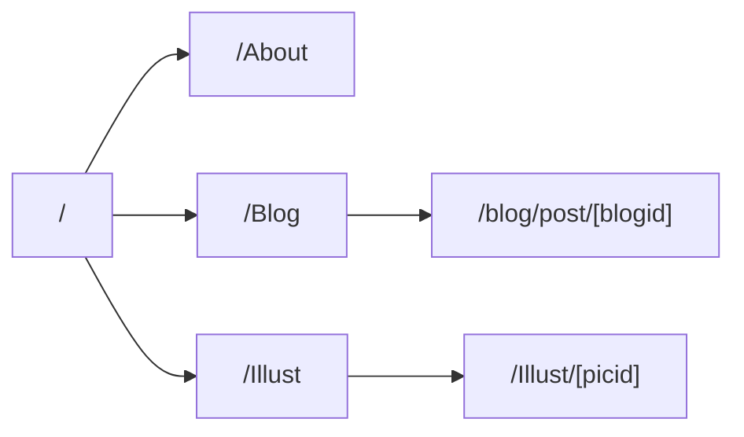

寒さが去ることを知らないこの頃、布団から出られないでおなじみの私。  
 

## Webサイト、はじめました。  
つい最近まではjavascriptのjの字も知らない、javaとjavascriptの違いもわからないような人間だったため、HTMLでそれっぽいページを作るのにすら一苦労していた。そこで勉強の一環として自分のWebサイトのようなものを作ってみることに。個人的にWeb関連はCやPythonなどを単純な演算から学んできたように基礎を積み重ねていく形ではなく、作りたいものがあってそこに必要な知識を調べるなりして獲得していく形が勉強として適しているなと思っている。  

記事などのコンテンツの更新や追加が簡便になるよう、動的ルーティングによって詳細ページを作ることを目的にNext.jsを用いることにした。多分役不足だろうが、環境構築が楽であることと、Reactは少し触れていたため知識が活かせるかなあと考えていたからである。←後々リソースの少なさに苦しむことに...  
 

### ページ構造

Dynamic Routingによって\[blogid]、\[picid]は適切なページのパスとして置き換えられる。  
 

### 使ったもの
- Next.js  
	フレームワーク。v13.4からの新機能であるところのApp routerを用いている。ページに対応するディレクトリにlayoutとpageさえ置けばあとはなんとかしてくれる。  
	ImageやLinkといった軽量、高速なコンポーネントも提供されていて良い。
- Vercel  
	ホスティング先。書いたNext.jsをデプロイしてくれる。
- typescript  
	言語。コンパイルエラーを吐いてくれるから修正がやりやすかったのは利点としてあると思う。
- gray-matter  
	記事のflontmatterを読み取ってくれる。
- next-mdx-remote  
	markdown、MDXをHTMLにしてくれる。
- ChatGPT 3.5  
	困ったときにとりあえずコードを投げるとそれっぽく直してくれる。jsからtsへの変換は散々してもらった。App routerに対応してないのが3.5らしい。  
 

### わかってない部分
- markdown、MDXで書いた記事はnext-mdx-remote/rscのMDXRemoteによってhtmlにコンパイルするようにしているが、serializeしたソースをnext-mdx-remoteのMDXRemoteでコンパイルしようとするとuseEffectがエラーを起こした。そもそもそれぞれの処理が何をしているかわかっていないので原因もわからない。
- mdxのコンポーネントのimport文が全く機能しなければ別にテキストとしてレンダリングされるわけでもないのでただ消えているだけになっている。どうして？結局propsとしてcomponentsを渡すことにしている。
 

